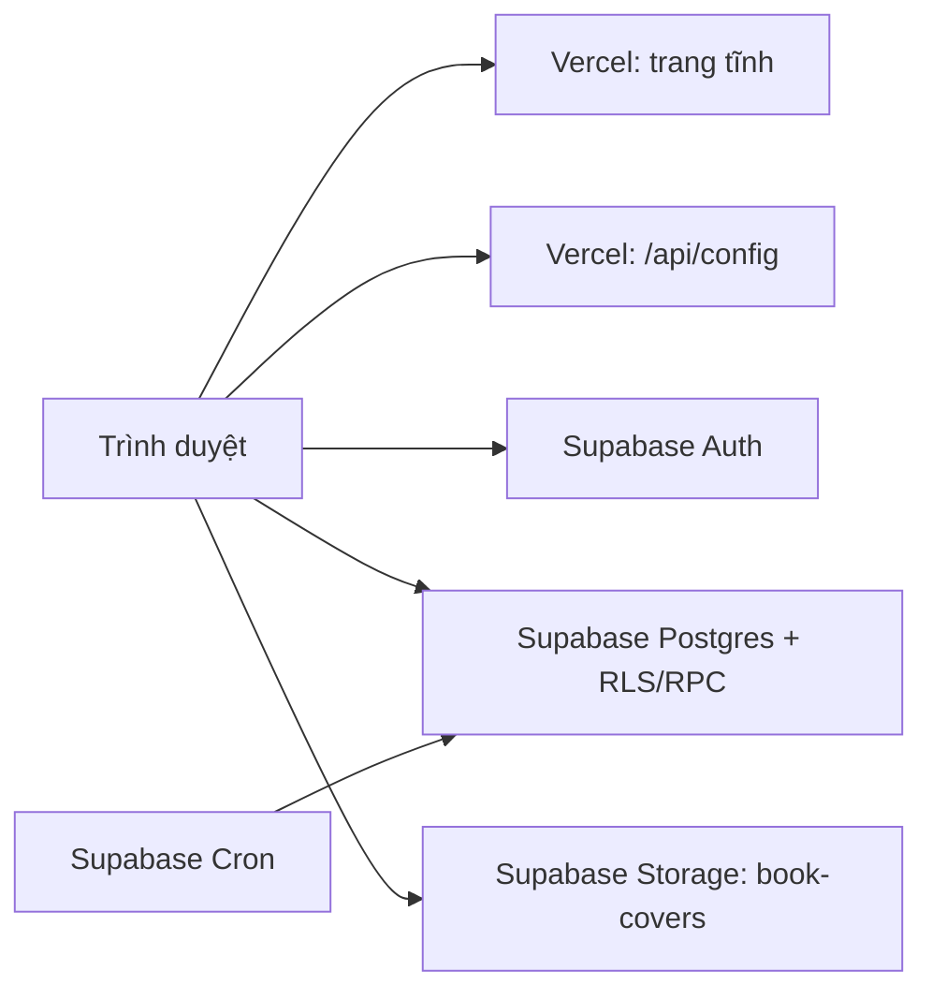

# IUH EduBook

Website demo để sinh viên tìm, đặt mua hoặc thuê giáo trình theo học kỳ, đồng thời để nhân viên quản lý sách, yêu cầu đặt, tài khoản và hỗ trợ chat. Giao diện tiếng Việt, dùng được trên desktop/mobile. Đây là **project demo**, chưa phải kênh chính thức của IUH hay hệ thống thanh toán trực tuyến.

| Thông tin | Giá trị |
| --- | --- |
| Bản tài liệu | 29/09/2026 |
| Website | [edubook-iuh.vercel.app](https://edubook-iuh.vercel.app/) |
| Mã nguồn | [Thanhhan1102/EduBook-Website](https://github.com/Thanhhan1102/EduBook-Website) · nhánh `main` |
| Supabase project | `jhhpygtddakqcdjthuxq` · [Dashboard](https://supabase.com/dashboard/project/jhhpygtddakqcdjthuxq) |
| Hosting | Vercel; push lên `main` sẽ kích hoạt deployment nếu Git integration còn hoạt động |

## Phạm vi và kiến trúc

Frontend là HTML/CSS/JavaScript thuần, không có framework hay bước build. Vercel phục vụ các trang tĩnh và Serverless Function `/api/config`. Browser dùng Supabase JS v2 qua CDN để truy cập Supabase Auth, PostgreSQL/RLS, RPC và Storage. Supabase Cron xử lý đơn hết hạn giữ sách.



`/api/config` trả Supabase URL, publishable key và URL chuyển hướng xác nhận email. **Publishable key là khóa công khai; RLS và các hàm database bảo vệ dữ liệu.** Không đưa secret/service-role key vào frontend, Git hoặc client config.

| Nơi lưu | Dữ liệu chính |
| --- | --- |
| Supabase Auth | Email, mật khẩu/xác nhận email và phiên đăng nhập. |
| `profiles` | Họ tên, mã sinh viên, khoa, liên hệ, vai trò `student`/`subadmin`/`admin`, trạng thái `active`. |
| `books` | Metadata sách, hình thức bán/thuê, độ mới, giá, tồn kho, URL ảnh và cờ `active`. |
| `orders`, `order_items` | Người đặt, điểm nhận, trạng thái, hạn giữ, tổng tiền/cọc và các dòng sách tại thời điểm đặt. |
| `support_messages` | Nội dung chat, bên gửi, thời điểm gửi/đã đọc theo từng sinh viên. |
| Storage `book-covers` | File ảnh bìa công khai; `books.image_url` trỏ tới ảnh. |

## Các trang và chức năng

| Trang | Nội dung |
| --- | --- |
| `index.html` | Home riêng, giới thiệu dịch vụ bán/thuê, tìm nhanh, menu sản phẩm và hộp chat hỗ trợ. |
| `catalog.html` | Catalog riêng, tách tab sách bán và sách thuê; tìm theo tên/mã môn/khoa, lọc độ mới, sắp xếp, xem chi tiết, giỏ hàng và form đặt sách. |
| `register.html` | Đăng ký email/mật khẩu với họ tên, mã sinh viên và khoa; gửi lại email xác nhận. |
| `login.html` | Một trang đăng nhập chung cho sinh viên, Admin và SubAdmin; xử lý callback/link xác nhận email. |
| `profile.html` | Thông tin tài khoản, lịch sử yêu cầu, trạng thái và đồng hồ giữ sách. |
| `admin.html` | Dashboard: giáo trình, yêu cầu đặt, hỗ trợ chat, tài khoản sinh viên và quản lý SubAdmin (chỉ Admin chính). |

Khách có thể xem catalog khi chưa đăng nhập. Sinh viên cần tài khoản đã xác nhận email mới đặt sách hoặc nhắn hỗ trợ. Form đặt cho xem lại sách, giá, thông tin liên hệ và điểm nhận. Popup chi tiết hiện tác giả, độ mới, tồn kho, giá bán/thuê; chỉ có nút chuyển mua/thuê khi sách hỗ trợ cả hai. Giao diện có animation, popup cuộn bên trong và bố cục mobile.

Admin/SubAdmin có thể thêm, chỉnh sửa, ẩn sách; chọn hình thức cung cấp, giá, độ mới, tồn kho và tải ảnh bìa; tìm và phân trang danh sách sách theo 20/50/100 mục. Dashboard cho lọc/tìm/sắp xếp yêu cầu, đổi trạng thái, xem cảnh báo sắp hết hạn, khóa/mở khóa sinh viên và trả lời chat. Chỉ Admin chính được cấp hoặc thu hồi quyền SubAdmin.

Chat lưu lịch sử theo tài khoản trong `support_messages`, làm mới khoảng mỗi 10 giây khi đang mở. Tin của người đang xem nằm bên phải: sinh viên thấy tin sinh viên bên phải, Admin/SubAdmin thấy tin nhân viên bên phải. Chat và cảnh báo giữ sách là thông báo **trong website**; chưa có email, push notification hoặc realtime subscription.

## Quy tắc nghiệp vụ

- Sách có hình thức `buy`, `rent` hoặc `both`. Chỉ sách `both` mới có nút chuyển mua/thuê trong popup. Sách cho thuê chỉ được lưu và đặt khi `condition = over80` (độ mới trên 80%); sách chỉ bán có thể là `new`, `over80` hoặc `over60`.
- Giá và tồn kho được lấy lại từ database khi đặt. Hàm `place_order` khóa bản ghi sách, kiểm tra quyền/tồn kho, tạo `orders` và `order_items`, rồi trừ tồn kho trong một transaction. Không dùng giá do browser gửi để tính tiền.
- **Cọc luôn miễn phí:** `orders.deposit = 0`. `total` là tổng giá sách theo các dòng đặt, chưa phải khoản tiền đã thu. Chưa có cổng thanh toán hoặc giao dịch tiền trực tuyến.
- Yêu cầu mới giữ sách tối đa **24 giờ**. Supabase Cron chạy mỗi phút; yêu cầu còn mở khi hết hạn được hủy và hoàn tồn kho. Nếu job Cron hoặc hàm kiểm tra chưa hoạt động, frontend chặn tạo yêu cầu mới.
- Trạng thái đơn: `pending` (chờ xác nhận) → `confirmed` (đã xác nhận) → `ready` (sẵn sàng nhận) → `completed` (hoàn tất). Admin có thể chọn trạng thái cần thiết hoặc `cancelled` (đã hủy). Đơn hoàn tất/đã hủy không đổi tiếp; hủy đơn hoàn tồn kho một lần.
- Tài khoản sinh viên bị khóa không thể đăng nhập vào website hay tạo yêu cầu đặt. Sinh viên chỉ đọc hồ sơ/đơn/chat của chính mình; nhân viên có quyền theo vai trò qua RLS.

## Dữ liệu mẫu và hình ảnh

`assets/js/book-store.js` chứa **47 sách mẫu** thuộc 14 khoa. `supabase/seed.sql` nạp chúng vào `books` và có thể chạy lại mà không ghi đè sách/tồn kho đã tồn tại. Sau khi sửa dữ liệu mẫu, chạy `node scripts/generate-seed.cjs` để tạo lại SQL. Nút **Bổ sung sách mẫu** trong dashboard chỉ thêm những ID còn thiếu.

Danh sách khoa: Công nghệ thông tin; Công nghệ Điện; Công nghệ Điện tử; Công nghệ Động lực; Công nghệ Nhiệt - Lạnh; Công nghệ May - Thời trang; Công nghệ Hóa học; Khoa học Cơ bản; Luật và Khoa học chính trị; Ngoại ngữ; Quản trị Kinh doanh; Thương mại - Du lịch; Kỹ thuật Xây dựng; Khoa học Sức khỏe. Tên hiển thị trong UI có tiền tố “Khoa”.

Ảnh bìa tải từ máy nằm trong Supabase Storage bucket công khai `book-covers` (JPG/PNG/WebP, tối đa 5 MB). Bảng `books` chỉ lưu `image_url`; cũng có thể dùng URL ảnh bên ngoài. Các sách mẫu dùng một số ảnh từ prototype và Unsplash, nên cần kiểm tra quyền sử dụng/độ chính xác trước khi vận hành thật. Logo ở `assets/images/LOGO-transparent.png`. Ảnh QR truy cập website ở [`assets/images/edubook-website-qr.png`](assets/images/edubook-website-qr.png); tạo lại bằng `python scripts/generate-qr.py` sau khi cài `Pillow` và `qrcode`.

## Thiết lập lại project

1. Import repo vào Vercel với **Framework Preset: Other**, Root Directory `./`; để trống Build/Output/Install Command. Không cần `npm install` hay build frontend.
2. Tạo Supabase project và chạy SQL trong **SQL Editor** theo thứ tự bảng dưới. Bật **Integrations → Cron** trước migration giữ sách. Chạy `supabase/seed.sql` sau migrations nếu cần sách mẫu.
3. Trong Vercel → **Settings → Environment Variables**, đặt `SUPABASE_PUBLISHABLE_KEY` bằng publishable key (`sb_publishable_...`) của Supabase. Có thể đặt `EDUBOOK_AUTH_REDIRECT_URL` nếu dùng domain khác. Redeploy sau khi sửa biến môi trường. `api/config.js` hiện cố định URL Supabase project `jhhpygtddakqcdjthuxq`; khôi phục sang project khác cần đổi URL đó.
4. Trong Supabase **Authentication → Providers → Email**, bật **Confirm Email**. Trong **URL Configuration**, đặt Site URL `https://edubook-iuh.vercel.app` và thêm Redirect URL `https://edubook-iuh.vercel.app/login.html` (hoặc domain mới tương ứng). Email template xác nhận dùng `{{ .ConfirmationURL }}`. Đăng ký chấp nhận email hợp lệ từ IUH, Gmail, Outlook...; ứng dụng hiện dùng email/mật khẩu, không tích hợp Google OAuth.
5. Đăng ký tài khoản thật, xác nhận email, rồi cấp vai trò Admin chính bằng SQL bên dưới. Admin chính có thể cấp SubAdmin cho tài khoản đã đăng ký trong dashboard.

| Thứ tự | File trong `supabase/migrations/` | Vai trò |
| --- | --- | --- |
| 1 | `202609240001_edubook.sql` | Bảng nền, Auth trigger, RLS, RPC đặt sách. |
| Chỉ database cũ | `202609250001_allow_all_emails.sql` | Cập nhật trigger đăng ký cũ giới hạn email IUH; project mới không cần. |
| 2 | `202609250002_admin_dashboard.sql` | Vai trò SubAdmin, tài khoản sinh viên, quyền nhân viên. |
| 3 | `202609250003_book_covers.sql` | Storage bucket/policy ảnh bìa. |
| 4 | `202609250004_rental_rules_free_deposit.sql` | Quy tắc sách thuê và RPC đặt sách cọc 0. |
| 5 | `202609250005_book_holds.sql` | Cột hạn giữ, hủy/hoàn kho và Cron 24 giờ. |
| 6 | `202609260001_support_chat.sql` | Bảng, RLS và danh sách chat hỗ trợ. |
| 7 | `202609260002_free_deposit_orders.sql` | Đưa cọc cũ về 0 và ràng buộc cọc miễn phí. |

**Không chạy lại migration nền `202609240001` trên database đang vận hành**: nó chứa phiên bản đầu của `place_order` tính cọc 20%, có thể ghi đè hàm mới. Nếu gặp lỗi `orders_deposit_free_check`, chạy lại toàn bộ `202609250004_rental_rules_free_deposit.sql`. Hướng dẫn SQL và xử lý lỗi chi tiết ở [`docs/SUPABASE_SETUP.md`](docs/SUPABASE_SETUP.md).

Để nâng một tài khoản đã đăng ký thành Admin chính, thay email trong câu lệnh này và chạy tại Supabase SQL Editor:

```sql
update public.profiles
set role = 'admin'
where id = (select id from auth.users where email = 'admin-cua-ban@example.com');
```

Sau đó đăng xuất/đăng nhập lại. Không lưu email/mật khẩu thực trong README. `note.md` là ghi chú tài khoản local và đã được `.gitignore` loại khỏi Git.

### Chạy local

Sau khi liên kết project với Vercel và thiết lập biến môi trường Development:

```powershell
npx vercel dev
```

`python -m http.server 4173` chỉ phục vụ phần giao diện/sách mẫu: server tĩnh không có `/api/config`, vì vậy Auth, chat, đặt sách và các thao tác Supabase sẽ không dùng được nếu không có cấu hình riêng.

## Bản đồ mã nguồn

| Đường dẫn | Chức năng |
| --- | --- |
| `assets/css/styles.css`, `assets/js/motion.js` | Design system, responsive layout, animation. |
| `assets/js/home.js`, `assets/js/app.js` | Menu Home; catalog, bộ lọc, popup, giỏ hàng, checkout. |
| `assets/js/auth.js`, `login.js`, `register.js`, `profile.js` | Supabase Auth, xác nhận email, vai trò và hồ sơ. |
| `assets/js/backend.js` | Client Supabase, thao tác sách/đơn/tài khoản/chat/Storage. |
| `assets/js/admin.js`, `admin-chat.js`, `support-chat.js`, `order-holds.js` | Dashboard, chat hai phía, trạng thái và đếm ngược giữ sách. |
| `api/config.js` | Vercel Function cấp cấu hình công khai cho browser. |
| `supabase/migrations/`, `supabase/seed.sql` | Schema/policies/functions/Cron và dữ liệu mẫu. |
| `scripts/generate-seed.cjs`, `scripts/generate-qr.py` | Tạo lại seed SQL và ảnh QR. |
| `scripts/create-test-users.cjs` | Tạo tài khoản thử nghiệm từ `note.md`; cần secret key, **không chạy** nếu không có nhu cầu rõ ràng. |

## Kiểm tra vận hành

- `/api/config` trả JSON có `url` và `publishableKey`; trả 503 nếu Vercel thiếu `SUPABASE_PUBLISHABLE_KEY`.
- Đăng ký → nhận email → xác nhận → đăng nhập. Email chưa xác nhận hoặc tài khoản bị khóa không được vào hệ thống.
- Catalog đọc được sách đang hoạt động; đặt thử một cuốn bằng tài khoản sinh viên, kiểm tra `orders`, `order_items` và tồn kho trong Supabase. Cọc phải bằng 0.
- Trong Supabase SQL Editor, `select public.book_holds_ready();` phải trả `true`; job `edubook-expire-book-holds` trong `cron.job` phải `active`. Kiểm tra trạng thái/hạn giữ ở hồ sơ và dashboard.
- Admin/SubAdmin xem, chỉnh sửa sách và trả lời chat; sinh viên chỉ thấy đơn/chat của mình. Admin chính thấy tab cấp quyền SubAdmin.
- Quét `assets/images/edubook-website-qr.png`: URL phải là `https://edubook-iuh.vercel.app/`.

Repo hiện không có test suite hoặc pipeline build tự động; các bước trên là kiểm thử chức năng thủ công. Không dùng sách mẫu, giá, rating, nội dung quảng bá hay thông tin liên hệ mẫu làm dữ liệu nghiệp vụ chính thức khi chưa xác minh.

Giỏ hàng hiện nằm trong bộ nhớ của trang nên sẽ mất khi tải lại. Supabase JS, Google Fonts và nhiều ảnh sách mẫu được tải từ dịch vụ ngoài; bản lưu Git không bảo đảm hiển thị đầy đủ khi offline. Sản phẩm chưa có thanh toán online, gửi email/push sau khi đặt, hoặc đồng bộ chat realtime.

## Khi lưu trữ hoặc khôi phục

Git chỉ lưu **mã nguồn, migrations, seed và asset đã commit**. Git **không** chứa dữ liệu sinh viên/đơn/chat đang chạy trong Supabase, Supabase Auth users, tệp trong Storage, Cron runtime state, biến môi trường Vercel, cấu hình domain/redirect hoặc `note.md`. Nếu cần bản lưu trữ có thể khôi phục đầy đủ, xuất/ghi lại riêng các phần này bằng phương thức an toàn của từng dịch vụ, rồi cất cùng thông tin phiên bản commit. Không đưa backup dữ liệu cá nhân hoặc secret key vào repository công khai.
